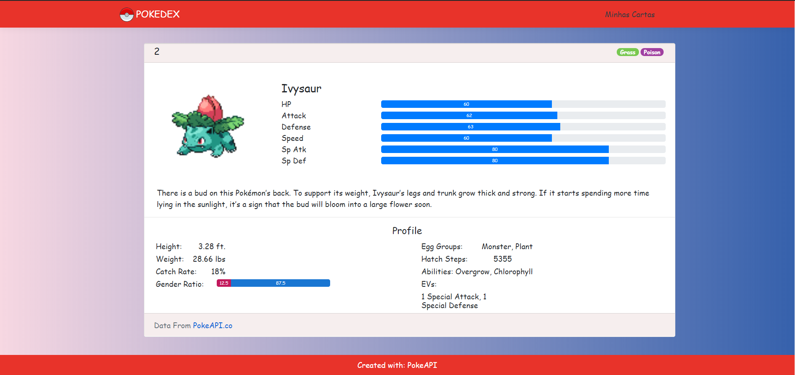
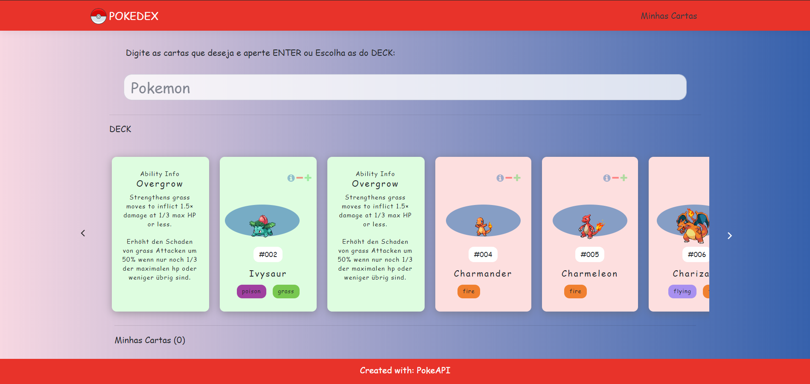
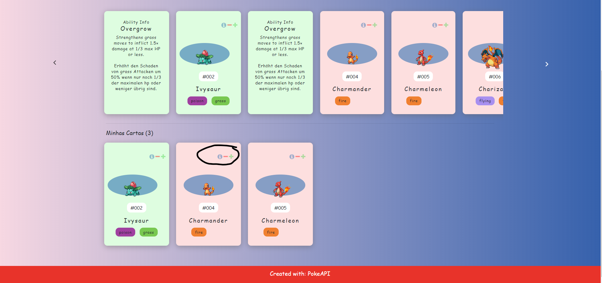

# CARD.Pokedex
Localiza Teste, REACT and sln .NET CORE

## Enviroment

Visual Studio 2019

## Functionality

In the project it is possible to add, remove and search, see details about the pokemon, as well as its profile.





## Folder Structure

After creation, your project should look like this:

```
my-app/
  README.md
  node_modules/
  package.json
  public/
    index.html
    favicon.ico
  src/
      components/
        layout/
          Dashboard.js
          Layout.js
          Loading.js
          spinner.gif
        pokemon/
          Pokemon.js
          PokemonCard.js
          PokemonList.js
        search/
          Search.js        
    App.js
    custom.css 
    App.test.js
    index.css
    index.js
    NavMenu.css
    NavMenu.js
    registerServiceWorker.js
    logo.svg
```

